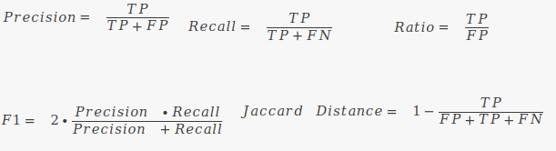

# Merlin paper

### Table of contents:

- [Requirements](#requirements)
- [Sequences](#sequences)
  - [Templates](#templates)
  - [Sequences for the curated models](#sequences-for-the-curated-models)
- [Tools models](#tools-models)
  - [AuReMe](#aureme)
  - [PathwayTools](#pathwaytools)
  - [CarveMe](#carveme)
  - [RAVEN](#raven)
  - [ModelSEED](#modelseed)
  - [AutoKEGGRec](#autokeggrec)
- [*Merlin* models](#merlin-models)
  - [Automatic workflow](#automatic-workflow)
  - [SamPler](#sampler)
  - [Workspaces](#workspaces)
- [Reactions identifier conversion](#reactions-identifier-conversion)
- [Drafts assessments](#drafts-assessments)
  - [Comparison of reaction sets](#comparison-of-reaction-sets)
  - [Comparison of gene sets](#comparison-of-gene-sets)
  - [Metrics](#metrics)
  - [Scripts](#scripts)

## Requirements

## Sequences

The gene sequences used to reconstruct each of the Genome-Scale Metabolic Models (GSMM) are stored in the folder "Sequences".
The files are in FASTA and GFF format. 
The FASTA file of the gene sequences used for AuReMe template models were preprocessed to include only the locus tag. 
The preprocessing scripts and resultant FASTA files are stored in the "Template models genomes processing" folder.
This preprocess will convert a file from this: 

```text
>lcl|NC_000913.3_prot_NP_414544.1_3 [gene=thrB] [locus_tag=b0003] [db_xref=UniProtKB/Swiss-Prot:P00547] [protein=homoserine kinase] [protein_id=NP_414544.1] [location=2801..3733] [gbkey=CDS]
MVKVYAPASSANMSVGFDVLGAAVTPVDGALLGDVVTVEAAETFSLNNLGRFADKLPSEPRENIVYQCWE
RFCQELGKQIPVAMTLEKNMPIGSGLGSSACSVVAALMAMNEHCGKPLNDTRLLALMGELEGRISGSIHY
DNVAPCFLGGMQLMIEENDIISQQVPGFDEWLWVLAYPGIKVSTAEARAILPAQYRRQDCIAHGRHLAGF
IHACYSRQPELAAKLMKDVIAEPYRERLLPGFRQARQAVAEIGAVASGISGSGPTLFALCDKPETAQRVA
DWLGKNYLQNQEGFVHICRLDTAGARVLEN
```

to this:

```text
>b0003
MVKVYAPASSANMSVGFDVLGAAVTPVDGALLGDVVTVEAAETFSLNNLGRFADKLPSEPRENIVYQCWE
RFCQELGKQIPVAMTLEKNMPIGSGLGSSACSVVAALMAMNEHCGKPLNDTRLLALMGELEGRISGSIHY
DNVAPCFLGGMQLMIEENDIISQQVPGFDEWLWVLAYPGIKVSTAEARAILPAQYRRQDCIAHGRHLAGF
IHACYSRQPELAAKLMKDVIAEPYRERLLPGFRQARQAVAEIGAVASGISGSGPTLFALCDKPETAQRVA
DWLGKNYLQNQEGFVHICRLDTAGARVLEN
```

This conversion is performed so that AuReMe could map the locus tag of each gene to the genes found in the template GSMM.

### Templates
The genome of *Escherichia coli* was obtained from the NCBI assembly [NC_000913.3](https://www.ncbi.nlm.nih.gov/nuccore/NC_000913.3).
The genome of *Lactococcus lactis* was obtained from the NCBI assembly [NC_009004.1](https://www.ncbi.nlm.nih.gov/nuccore/NC_009004.1).
The genome of *Plasmodium falciparum* was obtained in https://plasmodb.org/plasmo/app as in https://doi.org/10.1371/journal.pcbi.1005895.

### Sequences for the curated models

The genome files used for the reconstruction of the models of *Bordetella pertussis* and *Lactobacillus plantarum* 
were obtained from [here](https://github.com/SystemsBioinformatics/pub-data/tree/master/reconstruction-tools-assessment/pipeline/reconstructions/inputs/BPE)
and [here](https://github.com/SystemsBioinformatics/pub-data/tree/master/reconstruction-tools-assessment/pipeline/reconstructions/inputs/LPL).

The genome files used for the reconstruction of the models of *Toxoplasma gondii* were obtained in [here](https://toxodb.org/toxo/app/downloads/release-49/TgondiiME49/fasta/data/)
as in https://doi.org/10.1371/journal.pcbi.1004261.

## Tools models

Each draft and curated model is stored in the "Models" folder. 

### AuReMe 

AuReMe (Automatic Reconstruction of Metabolic Models) is a Docker-based software that allows reconstructing simulation-ready GSMMs using others as templates or inheriting a genome annotation from Pathway Tools. 

The AuReME Docker image version 2.4 was utilised to generate the draft models. AuReMe requires other models as templates and the genome files of the organisms under study, including the template ones. In this sense, the genome FASTA files were preprocessed only to contain the locus tag in the header of each gene. Moreover, the template models were imported to merlin in SBML level 3 and exported in SBML level 2 format. Otherwise, AuReMe could not be run as it does not support SBML level 3 template models. Then, an orthology-based reconstruction was generated using the Ortho-Finder algorithm. 

### PathwayTools 

Pathway Tools is software designed for the development of organism-specific metabolic databases. The application is developed in Lisp and provides a graphical interface that allows the user to visualise the whole constructed network. Moreover, it includes the assisted analysis of experimental data in the metabolic network. 

The Pathway Tools version 25.5 was downloaded and utilised to generate draft models of the mentioned organisms under study. For this matter, we uploaded the genome file in GeneBank format and performed the metabolic network reconstruction with the Pathologic algorithm using default parameters. Moreover, transport reactions were generated and included. Finally, the draft model was exported in an SBML format. 

### CarveMe 

CarveMe is a python package focused on fast reconstructing microbial metabolic models. It provides a top-down approach that creates simulation-ready models based on BiGG universal database. This tool uses Diamond to prioritise reactions with stronger genetic evidence (by similarity). 

The protein sequences were used as input in FASTA format using default parameters, providing simulation-ready GSM models in SBML format. The gap-filling mode of this tool was not used. 

### RAVEN 

RAVEN (Reconstruction, Analysis and Visualization of Metabolic Networks) is a command-line tool compliant with COBRA Toolbox v3, thus running in MATLAB. It provides functionalities to reconstruct models from scratch or use template models, merge networks from different databases and curate from the command line. 

The protein FASTA files were used as input to the version 2.5.3 of the tool, using the KEGG’s “prok90_kegg94” and “euk90_kegg94” templates for prokaryotic and eukaryotic organisms, respectively. The tool was used with default parameters, except for the “keepUndefinedStoich” and “keepIncomplete” (were set as False), and the cutOff value (adjusted to 10-30).  

### ModelSEED 

ModelSEED is a web tool to analyse and reconstruct GSMMs. The genome annotation is performed by RAST within ModelSEED, reconstructing the metabolic network based on that annotation. Moreover, it provides a graphical interface to analyse and gap-fill the model as well as run simulations. 

ModelSEED version 2 (November 2021) was used to reconstruct the draft models of the organisms under study. The genome FASTA files were inputted directly through the web interface, and the template models were defined by each type of organism (gram-positive bacteria for L. plantarum and gram-negative bacteria for B. pertussis). Finally, we selected a complete medium for the reconstruction.  

### AutoKEGGRec 

AutoKEGGRec v1.01 is a command-line tool that runs in MATLAB and provides compliance with COBRA Toolbox v3. This tool is highly suitable to generate multiple GSMMs only in one run and can also generate metabolic models for communities. The reconstruction is dependent on the availability of data for the target organism in KEGG. 

The KEGG’s organism identifiers for L. plantarum, B. pertussis, and T. gondii were used as input, using the “SingleRecs” mode, suitable for reconstruction of GSM models of individual organisms. After running the tool, the models were exported in SBML format. 

## *Merlin* models
*Merlin* BIT models were generated on the “use specific BiGG models information” option where we selected the template models. 

*Merlin* models will be referred to from hereafter using the following nomenclature: 

* Merlin-DFA – merlin model using Diamond “fast” mode and Automatic workflow; 

* Merlin-DFS – merlin model using Diamond “fast” mode and SamPler; 

* Merlin-DSA – merlin model using Diamond “sensitive” mode and Automatic workflow; 

* Merlin-DSS – merlin model using Diamond “sensitive” mode and SamPler; 

* Merlin-BA – merlin model using BLAST and Automatic workflow; 

* Merlin-BS – merlin model using BLAST and SamPler; 

### Automatic workflow

The phyllogenetic trees results used to assess the organisms for *Automatic workflow* are stored in the "Phyllogenetic tree" folder.

### SamPler

The *SamPler* parameters are stored in the "Sampler Parameters" folder.

### Workspaces

All the workspaces are present in the "Workspaces" folder.

## Reactions identifier conversion

The reactions identifier conversion was performed using the MetaNetX file of cross-references obtained [here](https://www.metanetx.org/mnxdoc/mnxref.html) and downloaded clicking in this link: https://www.metanetx.org/cgi-bin/mnxget/mnxref/reac_xref.tsv.

The obtained TSV format file was preprocessed to exclude the initial lines that refer the type of data, license and so on.
Then, reactions without conversion were removed and the file format was converted from 

```text
biggR:R_Htmi	MNXR03	secondary/obsolete/fantasy identifier
biggR:R_Htr	MNXR03	secondary/obsolete/fantasy identifier
biggR:R_Hts	MNXR03	secondary/obsolete/fantasy identifier
biggR:R_Htu	MNXR03	secondary/obsolete/fantasy identifier
biggR:R_Htx	MNXR03	secondary/obsolete/fantasy identifier
biggR:R_PCXHtpp	MNXR03	secondary/obsolete/fantasy identifier
metacyc.reaction:RXN-13519	MNXR03	vectoral H+ export||4 metacycM:PROTON@cco:CCO-IN --> 4 metacycM:PROTON@cco:CCO-OUT
```

to 

```text
Internal ID,External ID,Source
MNXR03,R_Htmi,BiGG
MNXR03,R_Htr,BiGG
MNXR03,R_Hts,BiGG
MNXR03,R_Htu,BiGG
MNXR03,R_Htx,BiGG
MNXR03,R_PCXHtpp,BiGG
MNXR03,RXN-13519,MetaCyc
```

This format conversion can be performed using the jupyter notebook "Scripts/Xrefs files/xrefs_files_reducer.ipynb".

## Drafts assessments

### Comparison of reaction sets 

The comparison of the reaction sets between the draft and curated models considered the following: 

* True Positives (TP) - reactions of the draft model with at least one alias in the curated model. 

* False Positives (FP) - reactions of the draft model without any alias in the curated model. 

* False Negatives (FN) - absent reactions in the draft model but present in the curated model. 

### Comparison of gene sets 

The comparison of the gene sets between the draft and curated models considered the following: 

* True Positives (TP) - genes present in the draft and curated models. 

* False Positives (FP) - genes present in the draft models and absent in the curated model. 

* False Negatives (FN) - absent genes in the draft models but present in the curated model. 


### Metrics



### Scripts

The scripts for draft models assessment are stored in the "Scripts" folder. 
The models assessment is present in the "Scripts/assessment.ipynb" jupyter notebook.
The graphs can be generated as in "Scripts/graphs_generation.ipynb". 
The results of this assessment are stored in the "Results" folder.


